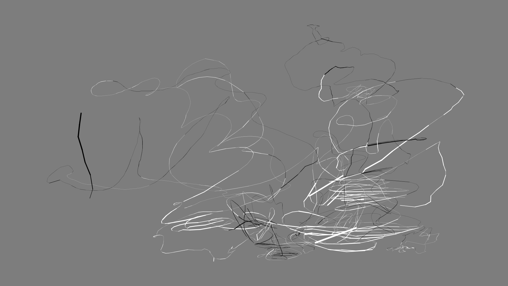

Leap Motion Drawing
===================

A little Processing app to draw with the Leap Motion.  
Cooked during the HardWareHackLab meetups by [Volumetric](http://www.meetup.com/volumetric/).  
_Note it's very rough, doesn't do much, but fun to play with._

### How to use
Start the app and put one finger above the controller. Start drawing.  
Press "c" to start a new drawing.  
No way to save the drawing (just take a screeshot).  
Using 2 hands will draw in a weird way (not intended, not sure it's a bug though ;) )

### How to modify
- Have [Processing3](http://processing.org) installed
- Clone the repository in your sketchbook folder. `git clone https://github.com/xuv/leapmotion_drawing.git`
- This sketch uses the [**Leap Motion for Processing** library from **Darius Morawiec**](https://github.com/nok/leap-motion-processing), so you won't be able to install it using the _Add Library_ menu. Just download the [archive](https://github.com/nok/leap-motion-processing/blob/master/download/LeapMotionForProcessing.zip?raw=true) and unzip it into your `sketchbook/libraries` folder.
- Open Processing, modify and run the sketch

### Copyright
Author: [Julien Deswaef](http://xuv.be)
License: [Free Art License 1.3](http://artlibre.org/licence/lal/en/)
